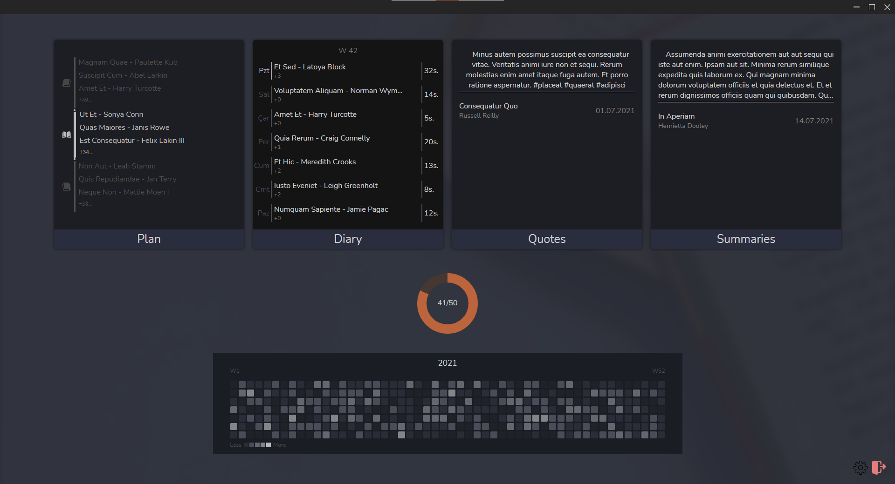

# Reading History

## Description
A desktop app that designed to track your readings. I've started to create this app to learn React, encryption, Ui/Ux design and coding.

## How to start project
In order to start the app you need to start the react development server.

### Start React Dev Server
`yarn start`
### Start Electron
`yarn electron`
### Build React
`yarn build`
### Build Electron
`yarn electron-build`

## To do
- [x] New single-page design.
- [ ] Add more info about reading data.
- [ ] Add autocomplete, more info about books(covers etc.) (Open Library Api).
- [ ] Refactor old code, make components less complex.
- [ ] Migrate to Next.Js.
- [ ] Create icon.
- [ ] Add tests.

